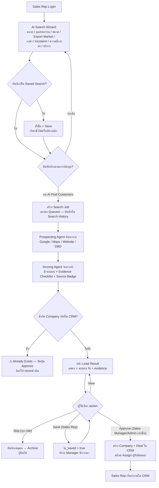
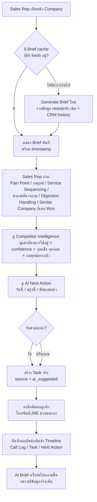
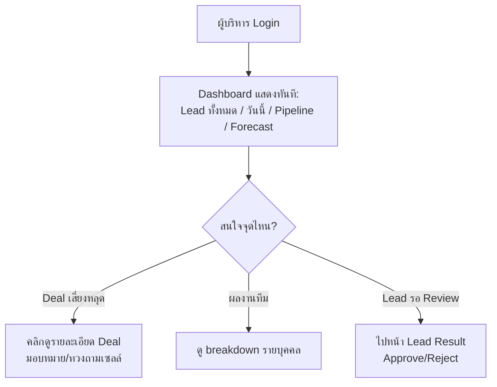
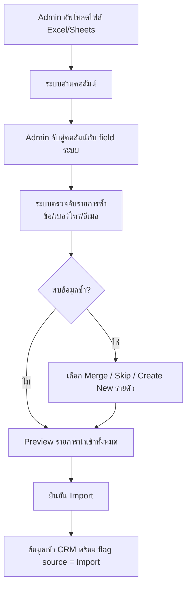
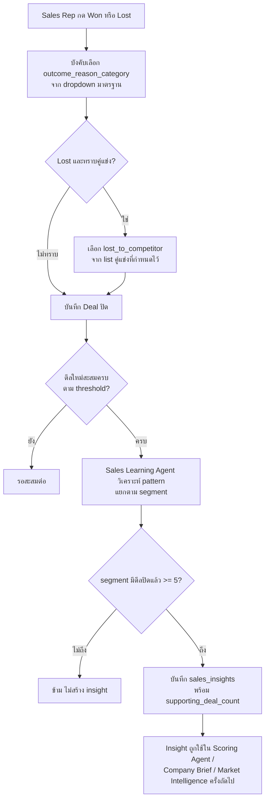
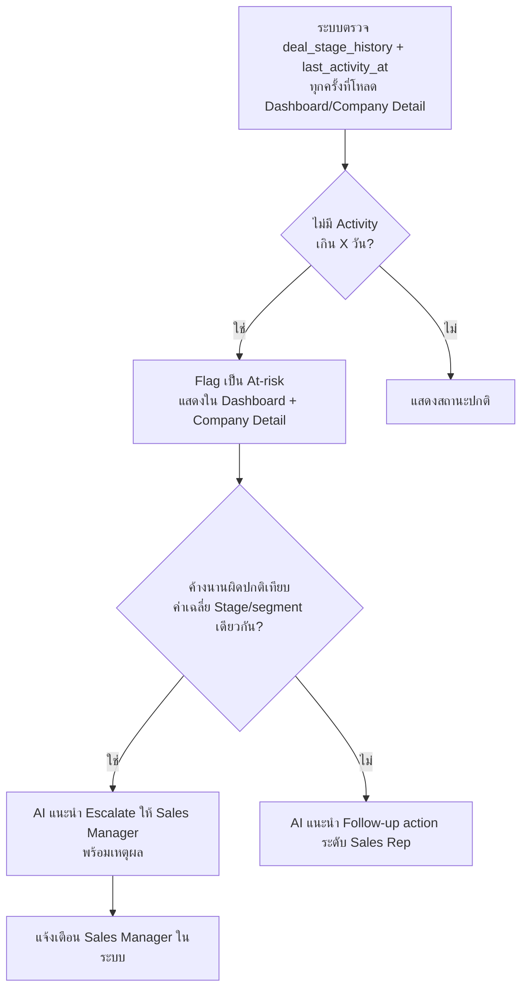

# User Flow
**เวอร์ชัน:** 1.2

---

## Flow 1: AI Find Customers → AI วิเคราะห์ → Lead Result → Approve → CRM

**อัพเดต:** เดิม flow ข้าม "Lead Result" ไปตรง Waiting Review ทำให้ไม่เห็นขั้นตอนที่ฝ่ายขายดูผลลัพธ์และคัดกรองก่อน แก้ไขให้เห็นขั้นตอนครบและระบุ role ที่ทำ action ได้ในแต่ละจุด



**หมายเหตุ:** ปุ่ม Approve แสดงเฉพาะ Sales Manager/Admin (คงหลัก human-in-the-loop) ส่วน Sales Rep ใช้ Save เพื่อเสนอให้พิจารณา — Deal ที่ approve แล้วเท่านั้นที่นับรวมใน Dashboard/Pipeline

---

## Flow 1B: Market Intelligence Snapshot (ก่อนตัดสินใจ Full Search)

```mermaid
flowchart TD
    A[เลือกประเทศเดียว เช่น Australia] --> B[Market Intelligence Agent\nนับจำนวนบริษัทตาม Industry แบบ aggregate]
    B --> C[แสดงภาพรวม:\nจำนวนรวม / breakdown ตาม Industry /\nLead ใหม่ / ระดับการแข่งขัน]
    C --> D{สนใจ Industry ไหนเป็นพิเศษ?}
    D -- เลือกแล้ว --> E[กด "ค้นหาแบบเจาะจง"\nส่งพารามิเตอร์ต่อให้ Flow 1 อัตโนมัติ]
    E --> F[เข้า AI Search Wizard\nพร้อมตัวกรองที่ preset ไว้แล้ว]
```

---

## Flow 2: เปิดบริษัท → AI Company Brief → ลงมือขาย



---

## Flow 3: Executive Dashboard Review



---

## Flow 4: Import ข้อมูลเดิมจาก Excel/Sheets



---

## Flow 5: ปิด Deal → Win/Loss Capture → Sales Learning Agent



---

## Flow 6: Deal Aging & Escalation


