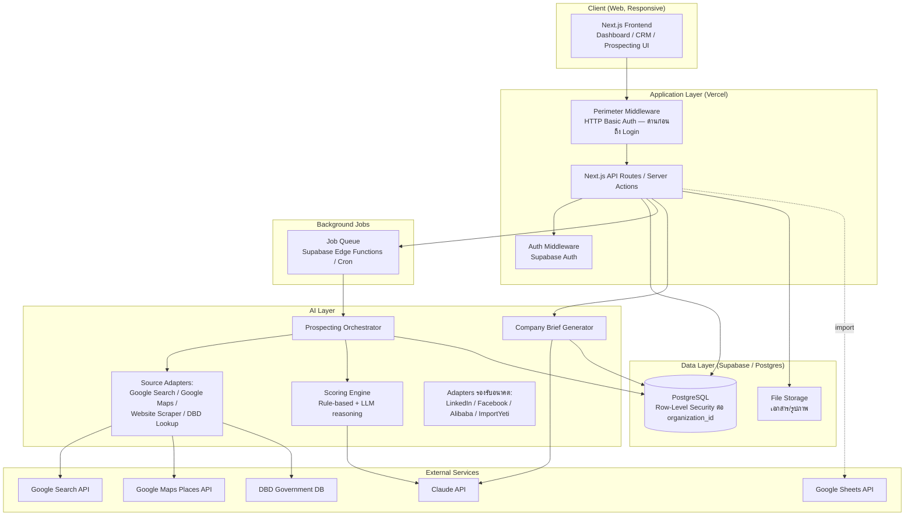

# System Architecture
**เวอร์ชัน:** 1.1

---

## 1. หลักการออกแบบ (Design Principles)

1. **Organization-first schema** — ทุกตารางผูกกับ `organization_id` ตั้งแต่วันแรก แม้ MVP จะมีองค์กรเดียว (RNP Group ครอบ RNP Express + PUKA Logistic) เพื่อให้ขยายเป็น multi-tenant SaaS ได้โดยไม่ rewrite
2. **Adapter Pattern สำหรับแหล่งข้อมูลภายนอก** — เพิ่ม LinkedIn/Facebook/Alibaba/ImportYeti ภายหลังได้โดยไม่แตะ core
3. **Async by default สำหรับงาน AI** — Search Job และ Brief Generation ทำงานผ่าน Job Queue ไม่ block request หลัก
4. **Human-in-the-loop gate** — ข้อมูลที่ AI สร้างต้องผ่านการอนุมัติของคนก่อนกลายเป็นข้อมูลจริงในระบบ (Waiting Review)
5. **Managed Service ก่อน Self-hosted** — เลือกใช้บริการ managed ที่มี free/starter tier เพื่อลดภาระทีม 1-2 คน แต่ทุกตัวต้อง "ย้ายออกได้" (Postgres มาตรฐาน, ไม่ผูก vendor lock-in ที่เปลี่ยนยาก)

---

## 2. High-level Architecture Diagram

---

## 3. คำอธิบายส่วนประกอบ

| ส่วนประกอบ | หน้าที่ | หมายเหตุ |
|---|---|---|
| **Next.js Frontend** | UI ทั้งหมด: Dashboard, CRM, Prospecting Selector, Waiting Review | Server-side rendering ช่วยให้ Dashboard โหลดเร็ว |
| **Perimeter Middleware** | ด่านแรกสุดก่อนถึงระบบจริง — HTTP Basic Auth ด้วย credential ร่วมของทีม กันคนนอกไม่ให้เห็นแม้แต่หน้า Login | รายละเอียดเต็มใน [14-Security-Permission-Model.md §2](14-Security-Permission-Model.md) — ทำให้ระบบเป็น "internal only" ไม่ขึ้นให้คนทั่วไปเห็นบนเว็บ |
| **API Layer** | Business logic, validation, RBAC enforcement | รวมอยู่ใน Next.js (API Routes/Server Actions) ไม่แยก service ใน MVP เพื่อความเร็วในการพัฒนา |
| **Auth** | Login, session, role | Supabase Auth (รองรับ email/password และขยายเป็น SSO ภายหลัง) |
| **Prospecting Orchestrator** | ควบคุม workflow การค้นหา: เรียก adapter → รวมผล → ส่งต่อ Scoring Engine → บันทึกสถานะ Waiting Review | รายละเอียดเต็มใน [09-AI-Agent-Architecture.md](09-AI-Agent-Architecture.md) |
| **Source Adapters** | แปลง API/ข้อมูลดิบจากแต่ละแหล่งให้เป็น schema กลางเดียวกัน | เพิ่มแหล่งใหม่ = เขียน adapter ใหม่ 1 ตัว ไม่กระทบของเดิม |
| **Scoring Engine** | คำนวณ 8 คะแนน + สร้างคำอธิบาย | Rule-based formula (โปร่งใส ปรับ weight ได้) + LLM สำหรับส่วนคำอธิบายและ Pain Point/Strategy |
| **Company Brief Generator** | สรุปข้อมูล on-demand เมื่อเปิดหน้าบริษัท | Cache ผลลัพธ์ พร้อม TTL/manual refresh เพื่อคุมต้นทุน |
| **Job Queue** | รันงาน AI แบบ async เบื้องหลัง | เริ่มต้นด้วย Supabase Edge Functions/Cron หรือ Vercel Background Functions — ปริมาณงานต่ำพอที่ไม่ต้องมี dedicated worker ใน MVP |
| **PostgreSQL (Supabase)** | ฐานข้อมูลหลัก | ใช้ Row-Level Security (RLS) ผูกกับ `organization_id` ตั้งแต่ต้น — กลไกเดียวกับที่ SaaS multi-tenant ในอนาคตต้องใช้ |
| **File Storage** | เอกสาร/รูปภาพบริษัท | Supabase Storage |

---

## 4. เส้นทางขยายสู่ Enterprise/SaaS (ไม่ต้อง Rewrite)

| วันนี้ (MVP) | อนาคต (SaaS) | สิ่งที่ต้องเพิ่ม | สิ่งที่ไม่ต้องแตะ |
|---|---|---|---|
| Organization เดียว (RNP Group) | หลาย Organization (ลูกค้า SaaS) | หน้า Sign-up, Billing (Stripe), Onboarding | Schema (มี organization_id อยู่แล้ว), RLS policy (ใช้ pattern เดิม) |
| Job Queue เบา (Edge Functions) | Volume สูงขึ้น | ย้ายไป dedicated worker (BullMQ/Temporal บน container แยก) | Adapter/Orchestrator logic เดิม เพียงเปลี่ยนตัวรัน |
| Vercel + Supabase | Dedicated infra เมื่อ scale เกิน managed tier | ย้าย Postgres ไป RDS/Cloud SQL (schema เดิม), แยก API เป็น service อิสระถ้าจำเป็น | โค้ด business logic หลัก (framework-agnostic query layer) |
| Auth ผู้ใช้ภายในบริษัทเดียว | Auth แบบ multi-tenant + SSO ลูกค้าองค์กร | เพิ่ม tenant switching, custom domain | RBAC model เดิม (ขยาย role ไม่ใช่ออกแบบใหม่) |

---

## 5. Cost Control Mechanisms (ตอบโจทย์งบ 3,000-10,000 บาท/เดือน)

- Search Job ทำงานเมื่อถูกสั่งเท่านั้น (ไม่มี cron auto-run ใน MVP)
- จำกัดจำนวนบริษัทต่อ Job (default 20-30) — ปรับได้ที่ระดับ Admin
- Dedupe ก่อนค้นหาซ้ำ (ไม่เสีย API call กับบริษัทที่มีอยู่แล้ว)
- Brief generation cache พร้อม manual refresh แทน auto-regenerate
- Log การใช้งาน AI/API ต่อ Job เพื่อให้ Admin เห็นต้นทุนจริงและปรับพฤติกรรมได้
