# Database Design (ER Diagram)
**เวอร์ชัน:** 1.7 — PostgreSQL, ทุกตารางมี `organization_id` (ยกเว้นตาราง lookup กลาง) เพื่อรองรับ Row-Level Security และ multi-tenant ในอนาคต

---

## 1. ER Diagram

```mermaid
erDiagram
    ORGANIZATIONS ||--o{ BUSINESS_UNITS : has
    ORGANIZATIONS ||--o{ USERS : employs
    ORGANIZATIONS ||--o{ COMPANIES : owns
    ORGANIZATIONS ||--o{ CANDIDATE_LEADS : owns
    ORGANIZATIONS ||--o{ SEARCH_JOBS : owns

    BUSINESS_UNITS ||--o{ DEALS : "sold under"

    SEARCH_JOBS ||--o{ CANDIDATE_LEADS : produces
    USERS ||--o{ SEARCH_JOBS : requests

    CANDIDATE_LEADS ||--o| LEAD_SCORES : "scored as"
    CANDIDATE_LEADS |o--o| COMPANIES : "approved into"

    COMPANIES ||--o{ CONTACTS : has
    COMPANIES ||--o{ DEALS : has
    COMPANIES ||--o{ ACTIVITIES : has
    COMPANIES ||--o{ TASKS : has
    COMPANIES ||--o{ QUOTATIONS : has
    COMPANIES ||--o{ DOCUMENTS : has
    COMPANIES ||--o| AI_BRIEFS : "cached brief"
    COMPANIES ||--o{ LEAD_SCORES : "rescored as"

    DEALS ||--o{ ACTIVITIES : has
    DEALS ||--o{ TASKS : has
    DEALS ||--o{ QUOTATIONS : has
    DEALS }o--|| USERS : "current owner"
    DEALS ||--o{ DEAL_STAGE_HISTORY : tracks

    COMPANIES ||--o| COMPETITOR_INTELLIGENCE : "predicted competitor"

    ORGANIZATIONS ||--o{ SALES_INSIGHTS : learns

    ORGANIZATIONS ||--o{ COMPETITORS : "manages master data"
    COMPETITORS ||--o{ COMPETITOR_INTELLIGENCE : "referenced by"
    COMPETITORS ||--o{ DEALS : "lost to (nullable)"

    ORGANIZATIONS ||--o{ EXPORT_JOBS : owns
    USERS ||--o{ EXPORT_JOBS : requests

    CONTACTS ||--o{ ACTIVITIES : "involved in"

    USERS ||--o{ ACTIVITIES : creates
    USERS ||--o{ AUDIT_LOGS : "acts as"

    ORGANIZATIONS ||--o{ IMPORT_JOBS : owns
    USERS ||--o{ IMPORT_JOBS : uploads

    ORGANIZATIONS ||--o{ SAVED_SEARCHES : owns
    USERS ||--o{ SAVED_SEARCHES : creates

    ORGANIZATIONS ||--o{ MARKET_INTELLIGENCE_SNAPSHOTS : owns
    USERS ||--o{ MARKET_INTELLIGENCE_SNAPSHOTS : requests

    USERS ||--o{ CANDIDATE_LEADS : "assigned to"
    USERS ||--o{ DEALS : "assigned via task/assignment"

    ORGANIZATIONS {
        uuid id PK
        text name
        int free_quota_companies_per_month "ค่าเริ่มต้น 100 — ปรับได้โดย Admin (FR-1.7)"
        numeric monthly_budget_cap "nullable — เพดานงบ/เดือน สำหรับ Budget Alert"
        timestamptz created_at
    }
    BUSINESS_UNITS {
        uuid id PK
        uuid organization_id FK
        text code "RNP_EXPRESS / PUKA_LOGISTIC"
        text name
        jsonb services "RNP_EXPRESS: [Express, Fulfillment] / PUKA_LOGISTIC: [Air Cargo, Sea Freight, Customs]"
    }
    USERS {
        uuid id PK
        uuid organization_id FK
        text name
        text email
        text role "admin/sales_manager/sales_rep/executive"
        text status "active/deactivated"
        timestamptz created_at
    }
    SEARCH_JOBS {
        uuid id PK
        uuid organization_id FK
        uuid requested_by FK
        text trade_direction "export/import — บังคับเลือก กำหนดความหมายของ target_countries (FR-1.0)"
        jsonb target_countries
        jsonb business_types
        jsonb services
        jsonb business_units
        text status "queued/running/completed/failed"
        int result_count
        numeric estimated_cost
        numeric actual_cost
        timestamptz started_at
        timestamptz completed_at
    }
    CANDIDATE_LEADS {
        uuid id PK
        uuid organization_id FK
        uuid search_job_id FK
        text name
        text business_type
        text website
        text facebook_url
        text email
        text phone
        text country
        text province_state
        int employee_count_est
        numeric revenue_est
        jsonb export_markets
        jsonb main_products
        text logo_image_url
        jsonb raw_source_data "ข้อมูลดิบจากแต่ละ adapter"
        jsonb sources "รายชื่อ source ที่ยืนยันเจอข้อมูล เช่น [Google, Website, DBD, Maps]"
        text status "pending_review/approved/rejected"
        boolean is_saved "ฝ่ายขายกด Save (สนใจ/เสนอให้พิจารณา) — ไม่เปลี่ยน status"
        uuid assigned_to FK "ผู้รับผิดชอบดำเนินการต่อ (nullable, self-claim ได้)"
        uuid reviewed_by FK
        timestamptz reviewed_at
        text rejection_reason
        timestamptz created_at
    }
    LEAD_SCORES {
        uuid id PK
        text subject_type "candidate_lead/company"
        uuid subject_id
        int opportunity_score
        int lead_score
        int difficulty_score
        int revenue_potential
        int competition_level
        int shipping_potential
        int export_potential
        int import_potential
        jsonb evidence "checklist หลักฐานต่อคะแนน เช่น ['Export ไป USA','มี Warehouse']"
        jsonb reasoning "คำอธิบายเชิงเนื้อหา + service_sequence + similar_company_refs"
        text model_version
        timestamptz computed_at
    }
    COMPANIES {
        uuid id PK
        uuid organization_id FK
        uuid created_from_candidate_id FK "nullable"
        text name
        text business_type
        text website
        text facebook_url
        text email
        text phone
        text country
        text province_state
        int employee_count_est
        numeric revenue_est
        jsonb export_markets
        jsonb main_products
        text logo_image_url
        text linkedin_url
        text google_maps_url
        jsonb hs_codes "รหัสพิกัดศุลกากรของสินค้าหลัก"
        boolean has_factory
        jsonb sources "provenance สืบทอดจาก candidate_leads.sources"
        text source "ai_prospecting/import/manual"
        text status "active/archived"
        timestamptz created_at
        timestamptz updated_at
    }
    CONTACTS {
        uuid id PK
        uuid company_id FK
        text name
        text position "ตำแหน่งจริงตามนามบัตร (free text)"
        text role_type "owner/export_manager/sales_manager/procurement/logistics/other — บทบาทมาตรฐานสำหรับ B2B logistics"
        text email
        text phone
        text line_id
        boolean is_primary
        text email_marketing_consent "subscribed/unsubscribed/not_asked — default not_asked (FR-23.3, ตาม PDPA)"
        timestamptz consent_updated_at "nullable — เวลาที่เปลี่ยนสถานะ consent ล่าสุด"
    }
    DEALS {
        uuid id PK
        uuid organization_id FK
        uuid company_id FK
        uuid business_unit_id FK
        text service_type
        text stage "new/contacted/qualified/quoted/negotiation/won/lost"
        numeric value_estimate
        text currency
        int probability
        uuid current_owner_user_id FK
        date expected_close_date
        timestamptz last_activity_at "denormalized จาก activities ล่าสุด — เร่ง query aging/at-risk"
        text outcome_reason_category "price/competitor_incumbent/transit_time/service_mismatch/relationship/other — บังคับกรอกเมื่อปิด Won หรือ Lost"
        uuid lost_to_competitor_id FK "อ้างอิง competitors.id — nullable = ไม่ทราบ/ไม่เกี่ยวข้อง"
        text outcome_reason_detail "free text เพิ่มเติม"
        timestamptz created_at
        timestamptz updated_at
    }
    DEAL_STAGE_HISTORY {
        uuid id PK
        uuid organization_id FK
        uuid deal_id FK
        text stage
        timestamptz entered_at
        timestamptz exited_at "nullable = stage ปัจจุบัน"
    }
    COMPETITORS {
        uuid id PK
        uuid organization_id FK
        text name "เช่น DHL, FedEx, SCGJWD — เพิ่ม/แก้ไข/ปิดใช้งานได้โดย Admin"
        boolean is_active "false = ไม่ใช้ในตัวเลือกใหม่ แต่ข้อมูลเก่าที่อ้างอิงอยู่ยังคงอยู่"
        text logo_url "nullable"
        uuid created_by FK
        timestamptz created_at
        timestamptz updated_at
    }
    COMPETITOR_INTELLIGENCE {
        uuid id PK
        uuid company_id FK
        uuid predicted_competitor_id FK "อ้างอิง competitors.id — nullable ถ้า confidence ต่ำเกินไป"
        int confidence_score "0-100"
        text confidence_level "low/medium/high"
        jsonb evidence
        jsonb why_this_prediction
        jsonb competitor_strengths
        jsonb competitor_weaknesses
        text recommended_strategy
        text recommended_service_first
        text model_version
        timestamptz generated_at
        boolean is_stale
    }
    SALES_INSIGHTS {
        uuid id PK
        uuid organization_id FK
        text scope_type "country/industry/service/business_type combination"
        jsonb scope_key "เช่น {country: Vietnam, industry: Food}"
        text insight_type "win_pattern/loss_pattern/market_response"
        text insight_text
        int supporting_deal_count "ต้อง >= threshold (ค่าเริ่มต้น 5) ก่อนแสดงผล — ดู FR-18.3"
        int confidence_score
        timestamptz generated_at
    }
    ACTIVITIES {
        uuid id PK
        uuid organization_id FK
        uuid company_id FK
        uuid deal_id "nullable"
        uuid contact_id "nullable"
        text type "call/meeting/email/line_message/note/task_completed/quotation/document/invoice/shipment_update/system"
        text subject
        text body
        timestamptz occurred_at
        uuid created_by FK
        jsonb metadata "เช่น invoice_number, shipment_reference สำหรับเชื่อมระบบปฏิบัติการขนส่งใน Phase 2"
    }
    TASKS {
        uuid id PK
        uuid organization_id FK
        uuid company_id FK
        uuid deal_id "nullable"
        text title
        date due_date
        uuid assigned_to FK
        text status "open/done"
        text source "manual/ai_suggested — จาก AI Next Action (FR-6.4)"
        timestamptz reminder_at
    }
    QUOTATIONS {
        uuid id PK
        uuid organization_id FK
        uuid company_id FK
        uuid deal_id FK
        text quote_number
        text service_type
        numeric amount
        text currency
        text status "draft/sent/accepted/rejected"
        timestamptz issued_at
        text file_url
    }
    DOCUMENTS {
        uuid id PK
        uuid organization_id FK
        uuid company_id FK
        uuid deal_id "nullable"
        text file_name
        text file_url
        uuid uploaded_by FK
        timestamptz uploaded_at
    }
    AI_BRIEFS {
        uuid id PK
        uuid company_id FK
        jsonb content "ทุก section ของ brief"
        text model_version
        timestamptz generated_at
        boolean is_stale
    }
    AUDIT_LOGS {
        uuid id PK
        uuid organization_id FK
        uuid actor_user_id FK
        text action
        text entity_type
        uuid entity_id
        jsonb before_state
        jsonb after_state
        timestamptz created_at
    }
    IMPORT_JOBS {
        uuid id PK
        uuid organization_id FK
        text source_type "excel/csv/google_sheets"
        uuid uploaded_by FK
        text file_name
        jsonb column_mapping
        text default_duplicate_strategy "create_new/skip/merge/update_existing — ค่าเริ่มต้น ปรับต่อแถวได้"
        text status
        int row_count
        int duplicate_count
        timestamptz created_at
    }
    EXPORT_JOBS {
        uuid id PK
        uuid organization_id FK
        uuid requested_by FK
        text format "xlsx/csv/google_sheets"
        jsonb filters "country[], industry[], service[], sales_owner[], deal_stage[], competitor_id[], date_range"
        text status "queued/running/completed/failed"
        int row_count
        text file_url "nullable — หรือ google sheets link"
        timestamptz created_at
        timestamptz completed_at
    }
    SAVED_SEARCHES {
        uuid id PK
        uuid organization_id FK
        uuid created_by FK
        text name "เช่น Japan Manufacturer Sea Freight"
        jsonb params "target_countries, business_types, services, wizard filters (FR-1.5)"
        timestamptz created_at
        timestamptz last_used_at
    }
    MARKET_INTELLIGENCE_SNAPSHOTS {
        uuid id PK
        uuid organization_id FK
        uuid requested_by FK
        text country
        jsonb industry_breakdown "เช่น {Food:120, Cosmetic:90, Furniture:80}"
        int total_companies
        int new_leads_count
        text competition_level "low/medium/high"
        timestamptz generated_at
    }
```

---

## 2. หมายเหตุการออกแบบที่สำคัญ

### 2.1 ทำไม Customer ไม่แยกตามบริษัท (RNP Express vs PUKA Logistic)
เนื่องจากลูกค้าส่วนใหญ่ใช้บริการทั้งสองบริษัทได้ (ตาม BRD) — `companies` (ลูกค้า) จึงเป็น **ฐานข้อมูลกลางเดียว** ส่วน "ใครเสนอบริการอะไร" ผูกไว้ที่ระดับ `deals.business_unit_id` และ `deals.service_type` แทน วิธีนี้ทำให้:
- Sales เห็นภาพรวมลูกค้าทั้งหมดในที่เดียว ไม่ต้องเปิด 2 ระบบ
- Dashboard แยกดูรายบริษัท (RNP Express / PUKA Logistic) ได้ด้วยการ filter บน `deals.business_unit_id`
- ลูกค้ารายเดียวอาจมี Deal พร้อมกัน 2 รายการจากทั้งสองบริษัท โดยไม่ซ้ำซ้อนข้อมูล company/contact

### 2.2 ทำไมแยก `candidate_leads` ออกจาก `companies`
เพื่อรองรับ Waiting Review workflow — ข้อมูลที่ AI ค้นเจอยังไม่ใช่ข้อมูลจริงของบริษัทจนกว่าจะถูก approve การแยกตารางทำให้:
- Query CRM/Dashboard ไม่ปนกับข้อมูลที่ยังไม่ผ่านการอนุมัติ
- ลบ/ปฏิเสธ candidate ที่ไม่ผ่านได้โดยไม่กระทบ schema ของ company จริง
- เมื่อ approve เพียง insert record ใหม่ใน `companies` โดยอ้างอิง `created_from_candidate_id` เพื่อย้อนดู provenance ได้

### 2.3 `lead_scores` เป็น polymorphic + เก็บประวัติ
คะแนนคำนวณได้ทั้งตอนเป็น candidate (ก่อน approve) และคำนวณใหม่ได้อีกหลังเป็น company จริง (เมื่อมีข้อมูลกิจกรรมเพิ่มขึ้น) การเก็บเป็นประวัติ (ไม่ overwrite) ทำให้ตรวจสอบย้อนกลับได้ว่าทำไมคะแนนเปลี่ยนไปตามเวลา — ตอบโจทย์ requirement "ทุกคะแนนต้องอธิบายเหตุผลได้"

### 2.4 Data Ownership ไม่ผูกกับ user
ไม่มี field แบบ `owner_id` ที่ผูก permission การเข้าถึงข้อมูล — ใช้ `current_owner_user_id` ใน `deals` เป็นเพียง "ผู้ดูแลปัจจุบัน" (reference เพื่อ UI/assignment) การเข้าถึงข้อมูลทั้งหมดควบคุมด้วย RBAC ระดับ Organization/Role ไม่ใช่ระดับ user-owns-record ทำให้พนักงานลาออกแล้วข้อมูลไม่หายและ reassign ได้ทันที

### 2.5 Multi-tenant readiness
ทุกตารางหลักมี `organization_id` และเปิด PostgreSQL Row-Level Security (RLS) ตั้งแต่ MVP แม้จะมี organization เดียวก็ตาม — เมื่อขยายเป็น SaaS จริง ไม่ต้องแก้ query logic ใดๆ เพิ่มแค่ organization ใหม่เข้าระบบ

**แก้ไข (หลังเริ่ม implement จริง):** ฉบับร่างแรกเขียน policy เป็น `organization_id = current_setting('app.current_org')` ซึ่ง**ใช้งานจริงไม่ได้**กับ Supabase เพราะ PostgREST (ที่ supabase-js เรียกอยู่เบื้องหลัง) ไม่ได้ตั้งค่า session variable นี้ให้ต่อ request — แก้เป็นใช้ **`auth.uid()`** (ที่ Supabase เติมให้อัตโนมัติจาก JWT ของผู้ใช้ที่ login อยู่) ผ่านฟังก์ชัน `private.current_org_id()` (security definer, join จาก `users` table) แทน — ดู `packages/db/migrations/0002_auth_integration.sql` สำหรับรายละเอียดเต็ม ทุก policy ในระบบอ้างอิงฟังก์ชันนี้ตัวเดียว ปรับ logic การหา org ได้จุดเดียวในอนาคต

### 2.6 `is_saved` แยกจาก `status` ใน candidate_leads
`is_saved` เป็นเพียง flag ความสนใจของ Sales Rep (ปุ่ม Save ใน Lead Result) ไม่ใช่การเปลี่ยนสถานะจริง — รายการยังอยู่ใน `status = pending_review` จนกว่า Sales Manager/Admin จะกด Approve/Reject การแยก field ทำให้ Sales Rep "ช่วยคัดกรอง" ได้โดยไม่ละเมิดกติกาว่าเฉพาะ Manager/Admin เท่านั้นที่อนุมัติเข้า CRM จริง (ดู [03-Functional-Requirements.md](03-Functional-Requirements.md) FR-4.2)

### 2.7 Similar Company ไม่ต้องมีตารางแยก
"บริษัทที่คล้ายกัน" (FR-3.5) คำนวณแบบ on-the-fly ด้วย query เทียบ `business_type` + `country` + ช่วง `employee_count_est`/`revenue_est` ของ `companies` ที่มี `deals.stage = won` เป็นหลัก ไม่จำเป็นต้องมีตารางเก็บผลลัพธ์ล่วงหน้าใน MVP (ข้อมูลยังน้อย query ตรงเร็วพอ) — ถ้าข้อมูลเยอะขึ้นในอนาคตค่อยพิจารณาทำ pre-computed embedding/similarity table แยก

### 2.8 Market Intelligence เป็นตารางแยกจาก Search Job โดยตั้งใจ
แม้จะใช้แหล่งข้อมูล/adapter ชุดเดียวกับ Prospecting Agent แต่ `market_intelligence_snapshots` เก็บเฉพาะตัวเลขสรุป (aggregate) ไม่ผูกกับ `candidate_leads` รายตัว เพราะเป้าหมายต่างกัน: Search Job ต้องการ "รายชื่อบริษัทที่ติดต่อได้" ส่วน Market Intelligence ต้องการ "ภาพรวมขนาดตลาด" การแยกตารางทำให้ query หน้า Dashboard ภาพรวมตลาดเร็วและถูก ไม่ต้อง join กับข้อมูลบริษัทละเอียดที่ไม่จำเป็น

### 2.9 `deal_stage_history` แยกจาก `deals` เพื่อความแม่นยำของ Aging
ถ้าเก็บแค่ `deals.stage` เฉยๆ จะไม่มีทางรู้ "อยู่ Stage นี้มากี่วันแล้ว" หรือ "Stage ไหนที่ดีลส่วนใหญ่ติดค้าง" — การมีตารางประวัติแยกทำให้คำนวณ Average Days per Stage, Longest Negotiation, Stage Age ได้แม่นยำและย้อนดูได้ทุกช่วงเวลา ไม่ใช่แค่สถานะปัจจุบัน **ข้อสำคัญ:** ต้องเริ่มบันทึกตั้งแต่วันแรกที่ระบบใช้งานจริง เพราะข้อมูลนี้ย้อนหลังสร้างทีหลังไม่ได้ (ตาม FR-17.1)

`deals.last_activity_at` เป็น field denormalized (คัดลอกมาจาก `activities` ล่าสุดของ deal นั้น อัพเดตทุกครั้งที่มี activity ใหม่) เพื่อให้ query "Deals at Risk" บน Dashboard เร็ว ไม่ต้อง join กับ `activities` ทุกครั้งที่โหลดหน้า

### 2.10 Competitor Intelligence เป็น cache แบบเดียวกับ AI Brief
`competitor_intelligence` ผูก 1:1 กับ `companies` (ไม่เก็บประวัติหลายเวอร์ชันใน MVP เพราะสถานการณ์คู่แข่งเปลี่ยนช้า) มี `is_stale` และปุ่ม Refresh แบบเดียวกับ `ai_briefs` — `predicted_competitor_id` เป็น `nullable` โดยตั้งใจ เมื่อ `confidence_level = low` ระบบจะไม่บังคับให้มีชื่อคู่แข่ง (ตาม FR-16.3 ห้ามเดา)

### 2.11 `sales_insights` ไม่ผูกกับ record ใดโดยตรง
Insight เป็นผลจากการรวมข้อมูลข้าม `deals` หลายรายการที่มี `outcome_reason_category`/`lost_to_competitor_id` ตรงกันภายใน segment เดียวกัน (`scope_key`) จึงไม่มี foreign key ไปยัง deal ใดโดยเฉพาะ — มีแค่ `supporting_deal_count` เพื่อยืนยันว่ามีข้อมูลสนับสนุนเพียงพอ (ตาม FR-18.3) ตารางนี้ถูก query โดย Market Intelligence Agent, Scoring Agent, และ Company Brief Agent เพื่อดึง insight ที่เกี่ยวข้องกับ segment ของบริษัทที่กำลังวิเคราะห์อยู่

### 2.12 `competitors` เป็น Master Data — ไม่ hardcode รายชื่อคู่แข่งในโค้ดหรือ prompt
รอบออกแบบก่อนหน้านี้ระบุรายชื่อคู่แข่ง (DHL, FedEx, UPS ฯลฯ) ไว้ตรงๆ ใน FR/prompt ของ Competitor Intelligence และ Win/Loss Capture ซึ่งแก้ไขยากถ้าต้องเพิ่มคู่แข่งใหม่ภายหลัง — ย้ายมาเป็นตาราง `competitors` ที่ Admin เพิ่ม/แก้ไข/ปิดใช้งานได้เอง (`is_active`) ทุกจุดที่เคยอ้างอิง list ตรงๆ (`deals.lost_to_competitor`, `competitor_intelligence.predicted_competitor`) เปลี่ยนเป็น FK `competitor_id` แทน **AI agent (Competitor Intelligence, Sales Learning Agent) ต้อง query ตาราง `competitors` ที่ `is_active = true` ณ เวลาทำงาน แล้วส่งรายชื่อนั้นเข้า prompt แบบ dynamic** ไม่ใช่ hardcode ไว้ในโค้ด (ตาม FR-19.4) การปิดใช้งาน (ไม่ใช่ลบ) คู่แข่งที่ไม่เกี่ยวข้องแล้ว ทำให้ประวัติ deal เก่าที่เคยอ้างอิงคู่แข่งนั้นยังคงถูกต้อง

### 2.13 `export_jobs` แยกจาก `import_jobs` แต่โครงสร้างคล้ายกัน
ใช้ pattern async job เดียวกับ Search Job/Import — `filters` เป็น jsonb เก็บเงื่อนไขทั้งหมดที่เลือก (country/industry/service/sales_owner/deal_stage/competitor_id/date_range) เพื่อให้ตรวจสอบย้อนหลังได้ว่า export แต่ละครั้งดึงข้อมูลตามเงื่อนไขอะไร (สำคัญด้าน audit เมื่อมีการนำข้อมูลลูกค้าออกจากระบบ)

### 2.14 Free Trial Quota ไม่ต้องมีตารางแยก — คำนวณสดจาก `search_jobs`
`organizations.free_quota_companies_per_month` เป็นแค่ค่า config (ตัวเลขเดียว) ส่วน "ใช้ไปแล้วเท่าไหร่ในเดือนนี้" คำนวณแบบ live query จาก `SUM(search_jobs.result_count)` และ `SUM(search_jobs.actual_cost)` ที่ `created_at` อยู่ในเดือนปัจจุบัน กรองด้วย `organization_id` — ไม่เก็บเป็น counter แยกต่างหาก เพื่อเลี่ยงปัญหาข้อมูลไม่ตรงกัน (sync bug) ระหว่างเวลาจริงใน `search_jobs` Admin/Usage Dashboard (FR-1.6/1.7) query ตารางนี้ตรงๆ ไม่ต้องมี job/cron แยกมาคำนวณ

### 2.15 เพิ่มบริษัทด้วยตนเองไม่ต้องเพิ่ม field/ตารางใหม่
`companies.source` มีค่า `manual` รองรับอยู่แล้วตั้งแต่การออกแบบรอบแรก (FR-22) — ต่างจากบริษัทที่มาจาก AI Prospecting ตรงที่ **ไม่ผ่าน `candidate_leads`/Waiting Review เลย** insert ตรงเข้า `companies` ทันทีเพราะมนุษย์เป็นผู้ยืนยันข้อมูลเองอยู่แล้ว `created_from_candidate_id` จะเป็น `null` สำหรับ record กลุ่มนี้ (ใช้แยกแยะ provenance ได้ตรงไปตรงมา)

### 2.16 `contacts.email_marketing_consent` — ทำไมแยกจาก field อื่น
เก็บเป็น 3 สถานะ (`subscribed`/`unsubscribed`/`not_asked`) แทนที่จะเป็น boolean เดียว เพราะ **"ไม่เคยถามความยินยอม" กับ "ถามแล้วปฏิเสธ" มีความหมายต่างกันทางกฎหมาย** — boolean เดียวจะแยกสองกรณีนี้ไม่ได้ Export ใดๆ ที่จะนำอีเมลไปใช้ทำการตลาด (FR-23.3) ต้อง `WHERE email_marketing_consent != 'unsubscribed'` เสมอในระดับ query ไม่ใช่แค่ filter ที่ UI (ป้องกันการลืม filter แล้ว export หลุดออกไป) `consent_updated_at` ใช้พิสูจน์ย้อนหลังคู่กับ `audit_logs` ว่าปฏิบัติตามคำขอ unsubscribe จริงเมื่อไหร่
