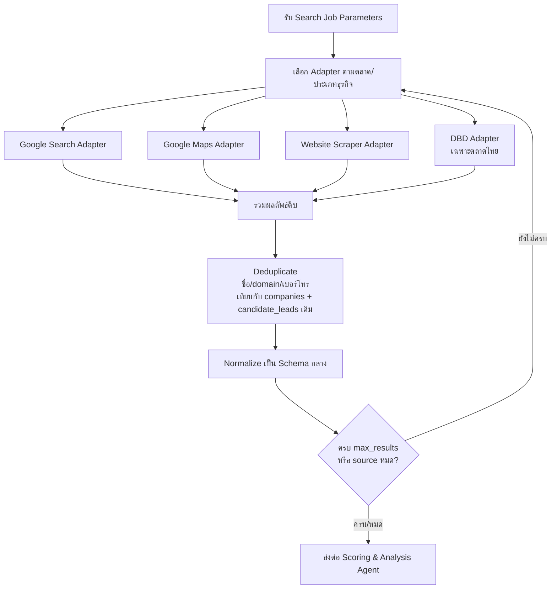
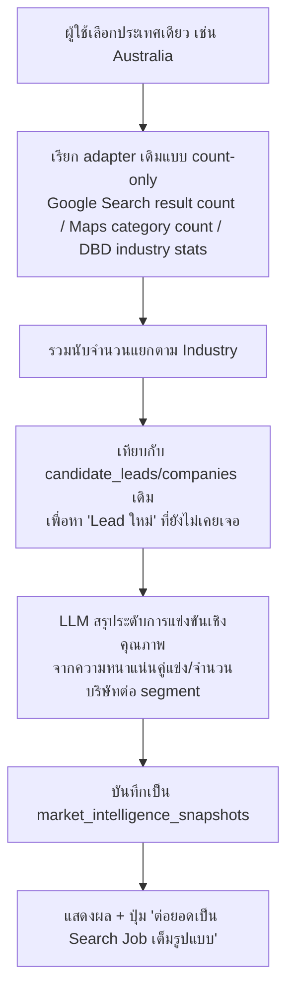
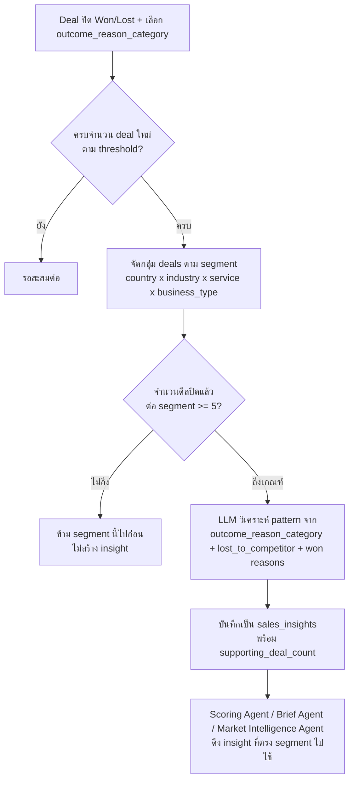

# AI Agent Architecture
**เวอร์ชัน:** 1.5
**แนวคิดหลัก:** ระบบนี้คือ "AI Sales Employee" ไม่ใช่ automation script — ประกอบด้วย 5 agent ที่ทำงานคนละหน้าที่ชัดเจน ไม่ใช่ agent เดียวทำทุกอย่าง และเป็น**ระบบที่เรียนรู้จากผลการขายจริง**ของ RNP/PUKA ผ่านเวลา ไม่ใช่แค่วิเคราะห์แบบ static

---

## 1. ภาพรวม 5 Agents

| Agent | ทำงานเมื่อไหร่ | หน้าที่ |
|---|---|---|
| **Prospecting Agent** | เมื่อ Sales Rep กด "AI Find Customers" | ค้นหาบริษัทเป้าหมายจากแหล่งข้อมูลภายนอก + ดึงข้อมูลดิบ พร้อมระบุ source ที่ใช้ |
| **Scoring & Analysis Agent** | ทันทีหลัง Prospecting Agent เจอบริษัท | คำนวณ 8 คะแนน + evidence checklist + Pain Point/Strategy/Service Sequencing พร้อมเหตุผล (เสริมด้วย insight จาก Sales Learning Agent เมื่อมี) |
| **Company Brief Agent** | เมื่อ Sales Rep เปิดหน้าบริษัท (on-demand) | สรุปข้อมูล + AI Next Action + Similar Company + **Competitor Intelligence** โดยผสมข้อมูล research เดิม + ประวัติจริงใน CRM |
| **Market Intelligence Agent** | เมื่อผู้ใช้เลือกดูภาพรวมตลาด/Country Intelligence Dashboard | สรุปสถิติตลาดระดับประเทศ/อุตสาหกรรมแบบ aggregate ต้นทุนต่ำ + สร้าง AI Insight 1 บรรทัดจากตัวเลข performance จริงใน CRM (เสริมด้วย insight จาก Sales Learning Agent เมื่อมี) |
| **Sales Learning Agent** | เมื่อมี Deal ปิด (Won/Lost) สะสมใหม่ หรือ Admin สั่ง recompute | ขุดหารูปแบบ (pattern) จากผล Win/Loss จริง แล้วส่งต่อเป็น insight ให้ agent อื่นใช้ — ทำให้ระบบ "ฉลาดขึ้นเรื่อยๆ" |

ทั้ง 5 agent ใช้ LLM ตัวเดียวกัน (Claude API) แต่คนละ prompt/context — แยกกันเพื่อให้ debug, ปรับปรุง, และคุมต้นทุนแต่ละส่วนได้อิสระจากกัน

---

## 2. Prospecting Agent

### 2.1 Trigger
เริ่มทำงานจาก Search Job เท่านั้น (manual trigger ตามที่ยืนยัน) รับ parameter: `target_countries[]`, `business_types[]`, `services[]`, `business_units[]`, `max_results` (default 20-30)

### 2.2 Orchestration Flow



### 2.3 Source Adapter Interface (สถาปัตยกรรมแบบ Pluggable)

ทุก Adapter implement interface เดียวกัน เพื่อให้เพิ่มแหล่งใหม่ได้โดยไม่แตะ Orchestrator:

```
interface SourceAdapter {
  name: string
  supportsCountry(countryCode): boolean
  search(params: SearchParams): RawCompanyResult[]
  costEstimatePerCall(): number
}
```

| Adapter | สถานะ MVP | หมายเหตุ |
|---|---|---|
| GoogleSearchAdapter | ✅ ใช้จริง | ค้นหาชื่อบริษัท + คำที่เกี่ยวกับประเภทธุรกิจ/สินค้า |
| GoogleMapsAdapter | ✅ ใช้จริง | Places API — ที่อยู่, เบอร์โทร, รูปภาพ, พิกัด |
| WebsiteScraperAdapter | ✅ ใช้จริง | ดึง About Us/Product/Contact จากเว็บที่เจอ |
| DBDAdapter | ✅ ใช้จริง (เฉพาะไทย) | ทุนจดทะเบียน, ประเภทธุรกิจตามกรมพัฒนาธุรกิจการค้า — ข้อมูลน่าเชื่อถือสูงสำหรับ Company Size/Revenue Potential |
| LinkedInAdapter | 🔲 Phase 2 | ต้องพิจารณาวิธีที่ไม่ผิด ToS (เช่น ให้ผู้ใช้ป้อนลิงก์ให้ AI อ่านทีละหน้า แทนการ crawl อัตโนมัติ) |
| FacebookAdapter | 🔲 Phase 2 | ใช้ Graph API สำหรับ Page ที่มีสิทธิ์เข้าถึงเท่านั้น |
| AlibabaAdapter | 🔲 Phase 2 | ไม่มี public API ทางการ ต้องประเมินวิธีที่เหมาะสมอีกครั้ง |
| ImportYetiAdapter | 🔲 Phase 2 | มี API แบบเสียเงิน ประเมิน ROI ก่อนเปิดใช้ |
| TradeShow/AssociationAdapter | 🔲 Phase 2 | ส่วนใหญ่เป็น batch import จากรายชื่อ (PDF/Excel) มากกว่า live search |

### 2.4 Deduplication Logic
เทียบ candidate ใหม่กับข้อมูลเดิมด้วยลำดับความสำคัญ: (1) domain เว็บไซต์ตรงกัน (2) เบอร์โทรตรงกัน (3) ชื่อบริษัท similarity > threshold (fuzzy match)

- ถ้าซ้ำกับ **candidate_lead เดิม** (ยังไม่ approve) และอยู่ในช่วง 90 วัน → ไม่สร้างใหม่ ข้าม เพื่อประหยัดต้นทุน (ตาม FR-2.5)
- ถ้าซ้ำกับ **company ที่ approve แล้ว** → ยังคงสร้าง candidate record ไว้ (เพื่อความครบถ้วนของผลการค้นหา) แต่ตั้ง flag พิเศษให้ UI แสดง badge **"⚠ Already Exists"** พร้อมลิงก์ไป company เดิม และปิดปุ่ม Approve สำหรับรายการนี้ (ตาม FR-2.8) — ป้องกันข้อมูลซ้ำซ้อนใน CRM โดยไม่ทิ้งข้อมูลการค้นพบ

### 2.5 Source Attribution (สำหรับ FR-2.7)
ทุก field ที่ Prospecting Agent เติมใน candidate record ต้องเก็บว่ามาจาก adapter ไหน (เช่น `phone` มาจาก `GoogleMapsAdapter`, `revenue_est` มาจาก `DBDAdapter`) โดยเก็บ mapping นี้ไว้ใน `raw_source_data` และสรุปเป็นรายการ adapter ที่ใช้จริงไว้ใน `candidate_leads.sources` — UI แสดงเป็น badge (✔ Google ✔ Website ✔ DBD ✔ Maps) เพื่อให้ผู้ใช้ตรวจสอบย้อนกลับได้เสมอว่าตัวเลข/ข้อมูลแต่ละอย่างไม่ได้มาจาก AI เดาเอง

---

## 3. Scoring & Analysis Agent

### 3.1 หลักการ: Rule-based Score + LLM Explanation (ไม่ใช่ LLM ตัดสินคะแนนแบบ black box)

เหตุผล: ผู้บริหารต้องตรวจสอบและปรับ weight ได้ ถ้าคะแนนมาจาก LLM ล้วนๆ จะอธิบาย/debug ไม่ได้ว่าทำไมปรับคะแนนแล้วผลเปลี่ยน

**ขั้นตอน:**
1. คำนวณคะแนนดิบด้วยสูตร weighted จาก field ที่มีจริง (deterministic, ทำซ้ำได้ผลเดิม)
2. ส่ง context (ข้อมูลบริษัท + คะแนนดิบ) ให้ LLM สร้าง**คำอธิบายเป็นภาษาธรรมชาติ** และเติมเต็มส่วนเชิงคุณภาพ (Pain Point, Strategy) ที่สูตรคำนวณเองไม่ได้

### 3.2 สูตรคะแนน (ตัวอย่าง เริ่มต้น — ปรับ weight ได้ผ่านตาราง config ไม่ hardcode)

| คะแนน | ปัจจัยหลักที่ใช้คำนวณ | ตัวอย่างน้ำหนัก |
|---|---|---|
| **Revenue Potential** | ทุนจดทะเบียน (DBD), จำนวนพนักงานประมาณ, ขนาดโรงงาน/คลังจาก Maps | ทุนจดทะเบียน 40%, พนักงาน 30%, ขนาดสถานที่ 30% |
| **Export Potential** | มีคำว่า export/ต่างประเทศบนเว็บ, ตลาดส่งออกที่ระบุ, สินค้าที่เหมาะกับการส่งออก | ข้อมูลตลาดส่งออกที่พบ 50%, ประเภทสินค้า 30%, ขนาดธุรกิจ 20% |
| **Import Potential** | มีการระบุแหล่งวัตถุดิบ/สินค้านำเข้า, ประเภทธุรกิจ Trading/ผู้นำเข้า | ประเภทธุรกิจ 50%, สินค้าที่พบ 30%, ตลาดที่เชื่อมโยง 20% |
| **Shipping Potential** | ประเภทสินค้า (ปริมาณ/น้ำหนัก/ความถี่ที่คาดว่าต้องขนส่ง), Business Type | ประเภทสินค้า 40%, ขนาดธุรกิจ 30%, ตลาดส่งออก/นำเข้า 30% |
| **Competition Level** | จำนวนคู่แข่งในพื้นที่/ประเภทธุรกิจเดียวกันที่เจอจาก Maps/Search | ความหนาแน่นคู่แข่งในรัศมี/ประเภทธุรกิจ |
| **Difficulty Score** | ขนาดบริษัท (บริษัทใหญ่มาก = อาจมี logistics partner ผูกสัญญาอยู่แล้ว = ยากขึ้น), Competition Level | ขนาดบริษัท 40%, Competition 40%, สัญญาณว่าใช้ผู้ให้บริการรายอื่นอยู่แล้ว 20% |
| **Lead Score** | ความครบถ้วน/คุณภาพของข้อมูลติดต่อที่หาได้ (มี email/เบอร์ตรง = ติดต่อง่าย) | ความครบของช่องทางติดต่อ 60%, ความน่าเชื่อถือของแหล่งข้อมูล 40% |
| **Opportunity Score** | ค่าเฉลี่ยถ่วงน้ำหนักของคะแนนอื่นทั้งหมด ปรับตาม Difficulty (โอกาสสูงแต่ยากมากจะลดคะแนนรวมลง) | Revenue+Export+Import+Shipping (70%) ปรับลดตาม Difficulty (30%) |

*ตัวเลข weight ข้างต้นเป็นจุดตั้งต้นสำหรับ MVP ต้องปรับจากข้อมูลจริงหลังใช้งาน 4-6 สัปดาห์แรก (ดู BRD หัวข้อ Baseline)*

**Trade Direction ปรับ weight ของ Opportunity Score (FR-1.0):** ค่า `search_jobs.trade_direction` ที่ผู้ใช้เลือกในหน้า Wizard ส่งต่อมาถึง Scoring Agent เพื่อปรับสัดส่วนใน Opportunity Score:
- โหมด **Export** → เพิ่มน้ำหนัก **Export Potential** ใน Opportunity Score formula (เช่นจาก 25% เป็น 40% ของ 70% ส่วนที่เป็น Revenue+Export+Import+Shipping) และให้ Prospecting Agent ค้นหาสัญญาณ "ส่งออกไปยัง [ประเทศที่เลือก]" เป็นหลัก
- โหมด **Import** → เพิ่มน้ำหนัก **Import Potential** แทน และให้ Prospecting Agent ค้นหาสัญญาณ "นำเข้าจาก [ประเทศที่เลือก]" เป็นหลัก
- Import Potential/Export Potential อีกตัวที่ไม่ตรงโหมดยังคำนวณและแสดงอยู่ (เผื่อบริษัทนั้นทำทั้งคู่) เพียงแต่ไม่ใช่ตัวหลักที่กำหนด Opportunity Score รอบนี้

### 3.3 Explainability Requirement (บังคับทุกคะแนน)

Output ของ Scoring Agent ต่อบริษัท 1 ราย ต้องมีโครงสร้างแบบนี้เสมอ (ไม่ใช่แค่ตัวเลข):

```json
{
  "scores": {
    "opportunity_score": 92,
    "lead_score": 65,
    "difficulty_score": 40,
    "revenue_potential": 82,
    "competition_level": 55,
    "shipping_potential": 88,
    "export_potential": 90,
    "import_potential": 20
  },
  "evidence": [
    "✔ Export ไป USA",
    "✔ Website ยัง Active",
    "✔ มี Warehouse",
    "✔ มี Shipping Department",
    "✔ มี Email ฝ่ายขายโดยตรง",
    "✔ เปิดบริษัทมาแล้ว 12 ปี",
    "✔ ส่งออกสินค้าประเภทอาหาร"
  ],
  "reasoning": {
    "why_this_score": "บริษัทมีทุนจดทะเบียน 50 ล้านบาท ตามข้อมูล DBD และระบุตลาดส่งออกไปเวียดนาม/จีนบนเว็บไซต์ชัดเจน จึงมี Export Potential สูง",
    "should_pursue": "ควรเข้าไปขาย เนื่องจาก Opportunity Score สูงและ Difficulty ต่ำ-กลาง ยังไม่พบสัญญาณว่าผูกสัญญากับผู้ให้บริการโลจิสติกส์รายใหญ่",
    "pain_points": ["น่าจะมีปัญหาต้นทุนขนส่งทางเรือที่สูงเพราะปริมาณส่งออกยังไม่มาก (ต่อรองราคากับสายเรือเองไม่ได้)"],
    "recommended_services": ["Sea Freight", "Customs Clearance"],
    "service_sequence": [
      {"order": 1, "service": "Air Cargo", "why": "ปริมาณยังน้อย เริ่มด้วย Air Cargo ความเสี่ยงต่ำ เห็นผลเร็ว"},
      {"order": 2, "service": "Sea Freight", "why": "ยังไม่ควรเริ่มตอนนี้ เพราะปริมาณ/ความถี่ต่ำกว่าจุดคุ้มทุนของเรือ — เสนอเมื่อ volume เพิ่มขึ้น"}
    ],
    "strategy": "เริ่มต้นด้วยการเสนอราคาทดลอง Air Cargo ล็อตเล็กก่อน เพื่อสร้างความน่าเชื่อถือ ก่อนต่อยอดเป็น Sea Freight ระยะยาว"
  },
  "sources": ["Google", "Website", "DBD", "Maps"]
}
```

ฟิลด์ `evidence` และ `reasoning` ทั้งหมดถูกเก็บลง `lead_scores.evidence` / `lead_scores.reasoning` (jsonb) ตาม Database Design และแสดงคู่กับตัวเลขเสมอในทุกหน้าที่โชว์คะแนน — ห้าม UI แสดงคะแนนโดยไม่มี `evidence` checklist กำกับ (ตรงตาม FR-3.3) `sources` ใช้แสดง badge แหล่งข้อมูลตาม FR-2.7

---

## 4. Company Brief Agent

### 4.1 ความแตกต่างจาก Scoring Agent
Scoring Agent วิเคราะห์ตอน "เพิ่งเจอ" บริษัท (ข้อมูลจำกัด) ส่วน Company Brief Agent ทำงาน**ทุกครั้งที่ถูกเรียกหลังจากนั้น** และใช้ข้อมูลที่สะสมมากขึ้นเรื่อยๆ จาก CRM จริง (call log, quotation, ผลการเจรจา) ทำให้ Brief แม่นยำขึ้นตามเวลา ไม่ใช่ก็อปผลจาก Scoring Agent ซ้ำ

### 4.2 Input Context ที่ป้อนให้ LLM
1. ข้อมูล research เดิม (จาก candidate_leads/companies)
2. คะแนนล่าสุดจาก `lead_scores`
3. Timeline กิจกรรมทั้งหมดของบริษัทนี้ (call log, meeting notes, quotation ที่เคยส่ง, สถานะ deal ปัจจุบัน)

### 4.3 Output ต้องตอบครบตาม FR-6.1
ธุรกิจ/ขนาด/ลูกค้าหลัก, Pain Point, โอกาสใช้บริการ RNP/PUKA, คู่แข่ง, คำถามที่ควรถาม, ข้อโต้แย้งที่น่าจะเจอ + วิธีตอบ, กลยุทธ์การขาย, ช่องทางติดต่อที่เหมาะสม, เวลาที่ควร follow-up

### 4.4 AI Next Action (FR-6.4)
นอกจาก Brief แบบข้อความ ต้อง output รายการ action พร้อมกรอบเวลาเจาะจงเสมอ เช่น:
```json
"next_actions": [
  {"when": "today", "action": "โทรหา Export Manager เพื่อยืนยันปริมาณสินค้า"},
  {"when": "tomorrow", "action": "ส่ง Follow-up email พร้อมใบเสนอราคาเบื้องต้น"},
  {"when": "next_week", "action": "นัดประชุมเพื่อเจรจาเงื่อนไข"}
]
```
ผู้ใช้กด "รับคำแนะนำ" รายการใดรายการหนึ่ง → ระบบสร้าง record ใน `tasks` โดยตั้ง `source = ai_suggested` และแปลง `when` เป็น `due_date`/`reminder_at` จริง — ไม่มีการสร้าง Task อัตโนมัติโดยไม่ผ่านการยืนยันของผู้ใช้

### 4.5 AI Similar Company (FR-3.5)
Company Brief Agent สืบค้น company ที่มี `deals.stage = won` และ business_type/country/ขนาดใกล้เคียงกัน (query ตรงตาม Database Design §2.7) แล้วให้ LLM สรุปเหตุผลความคล้ายและอ้างอิงผลลัพธ์ที่เคยเกิดขึ้นจริง เช่น `"similar_to": {"company": "ABC Trading", "outcome": "Won — Sea Freight", "why": "ประเภทธุรกิจและขนาดพนักงานใกล้เคียงกัน"}` ช่วยให้ฝ่ายขายอ้างอิง case จริงระหว่างเจรจา

### 4.6 Competitor Intelligence (FR-16)

**Input:** ข้อมูล company (website content, ข่าว/press ที่ Google Search เจอ, logo/case study บนเว็บไซต์ลูกค้าถ้ามี) + รายชื่อคู่แข่งที่ query สดจาก **Competitor Master** (ตาราง `competitors` ที่ `is_active = true` — ดู FR-19 และ Database Design §2.12) **ห้าม hardcode รายชื่อคู่แข่งไว้ใน prompt template** เพราะ Admin อาจเพิ่ม/ปิดใช้งานคู่แข่งเมื่อไหร่ก็ได้ — Orchestrator ต้องดึงรายชื่อล่าสุดมาประกอบ prompt ทุกครั้งที่เรียก agent นี้

**Output:**
```json
{
  "predicted_competitor_id": "uuid-of-dhl-in-competitors-table",
  "predicted_competitor_name": "DHL",
  "confidence_score": 62,
  "confidence_level": "medium",
  "evidence": ["พบโลโก้ DHL ในหน้า 'Our Partners' ของเว็บไซต์บริษัท", "ข่าวประชาสัมพันธ์ปี 2024 กล่าวถึงการร่วมงานกับ DHL Express"],
  "why_this_prediction": "หลักฐานจากเว็บไซต์ตรงและชัดเจน แต่ไม่มีข้อมูลยืนยันปริมาณ/สัญญาปัจจุบัน จึงให้ confidence ระดับกลาง",
  "competitor_strengths": ["เครือข่ายเส้นทาง Express ครอบคลุมกว่า", "แบรนด์เป็นที่รู้จักสูงในกลุ่มลูกค้าองค์กร"],
  "competitor_weaknesses": ["ราคาสูงกว่าสำหรับ Sea Freight ปริมาณน้อย", "ความยืดหยุ่นด้าน Customs Clearance ในไทยต่ำกว่าผู้เล่นท้องถิ่น"],
  "recommended_strategy": "เข้าหาในจุดที่ DHL อ่อน — เสนอ Customs Clearance ที่ยืดหยุ่นกว่าและ Sea Freight ราคาดีกว่าสำหรับปริมาณน้อย แทนที่จะแข่ง Express ตรงๆ",
  "recommended_service_first": "Customs Clearance"
}
```

**กลไก "ห้ามเดา" (FR-16.3):** ถ้าหลักฐานไม่ถึงเกณฑ์ (ค่าเริ่มต้น confidence < 50) ให้ตั้ง `predicted_competitor_id: null`, `confidence_level: "low"` และ `why_this_prediction: "ข้อมูลไม่เพียงพอที่จะระบุคู่แข่งปัจจุบัน"` แทนการเลือกคู่แข่งแบบสุ่มเดา — UI ต้องแสดงข้อความนี้ตรงๆ ไม่ใช่ซ่อนหรือแสดงคู่แข่งเริ่มต้น

**คุณภาพ MVP vs Phase 2:** แหล่งข้อมูล MVP (Website + Google Search) ให้หลักฐานทางอ้อมเท่านั้น (โลโก้/ข่าว) — confidence เฉลี่ยจะอยู่ Low-Medium เป็นหลัก เมื่อเพิ่ม **ImportYeti** (Phase 2 — ข้อมูล bill of lading ระบุผู้ให้บริการขนส่งจริงต่อ shipment) จะเป็นแหล่งข้อมูลที่แม่นยำที่สุดสำหรับโมดูลนี้โดยเฉพาะ ควรจัดลำดับความสำคัญการเพิ่ม ImportYeti adapter ให้สูงกว่า adapter อื่นใน Phase 2 ถ้า Competitor Intelligence ได้รับผลตอบรับดีจากฝ่ายขาย

### 4.7 Caching Strategy
- Brief และ Competitor Intelligence ถูก cache ใน `ai_briefs` / `competitor_intelligence` พร้อม `generated_at`
- Flag `is_stale = true` เมื่อมี activity ใหม่เพิ่มเข้ามาในบริษัทนั้น (เช่น มี call log ใหม่) — แสดง badge "มีข้อมูลใหม่ กด Refresh"
- ไม่ auto-regenerate ทุกครั้งที่เปิดหน้า (คุมต้นทุนตาม FR-6.3) — ผู้ใช้กด Refresh เองเมื่อต้องการ (Competitor Intelligence เปลี่ยนแปลงช้ากว่า Brief ทั่วไป จึง refresh ได้ไม่บ่อยเท่า)

---

## 5. Market Intelligence Agent (FR-15) ⭐

### 5.1 ความแตกต่างจาก Prospecting Agent
Prospecting Agent ค้นหาและวิเคราะห์ **รายบริษัท** (แพง — ต้องทำ full enrichment + scoring ทีละราย) ส่วน Market Intelligence Agent สนใจแค่ **ตัวเลขนับรวมระดับตลาด/อุตสาหกรรม** (ถูกกว่ามาก) จึงเรียกใช้ได้บ่อยกว่าโดยไม่กระทบงบประมาณ

### 5.2 Flow


### 5.3 Output ตัวอย่าง
```json
{
  "country": "Australia",
  "total_companies": 320,
  "industry_breakdown": {"Food": 120, "Cosmetic": 90, "Furniture": 80, "Other": 30},
  "new_leads_count": 40,
  "competition_level": "low",
  "reasoning": "จำนวนคู่แข่งโลจิสติกส์ที่ให้บริการกลุ่ม Food ในตลาดนี้ยังน้อยเมื่อเทียบกับขนาดตลาด จึงประเมินการแข่งขันอยู่ในระดับต่ำ"
}
```

### 5.4 เหตุผลที่ทำเป็น Agent แยก
ถ้ารวมเข้ากับ Prospecting Agent จะทำให้ทุกครั้งที่อยากรู้ "ภาพรวมตลาด" ต้องรัน full prospecting (แพงและช้าโดยไม่จำเป็น) การแยก agent ทำให้ผู้บริหาร/ฝ่ายขายเปิดดูภาพรวมตลาดได้บ่อยเท่าที่ต้องการโดยแทบไม่กระทบ budget cap ตาม §7

### 5.5 Country Intelligence AI Insight (FR-21.3)
Market Intelligence Agent ยังรับผิดชอบสร้างข้อความสรุป 1 บรรทัดต่อประเทศบน **Country Intelligence Dashboard** เช่น "ตลาด Australia มี Win Rate สูงสุด และคู่แข่งหลักคือ DHL" — ต่างจาก §5.1-5.3 ตรงที่ input เป็น**ตัวเลข performance จริงจาก CRM** (Win Rate, Top Competitor จาก `deals`/`competitor_intelligence`) ไม่ใช่ข้อมูลภายนอก จึงเป็นการเรียก LLM แบบเบา (สรุปตัวเลขที่ query มาแล้วให้เป็นประโยค ไม่ต้องค้นหา/enrich เพิ่ม) ต้นทุนต่ำมากเทียบกับ §5.1-5.3 จึงยังอยู่ในงบเดิมได้แม้เพิ่มความสามารถนี้เข้าไป — เมตริกที่ข้อมูลไม่พอ (ตาม FR-21.4) จะไม่ถูกนำมาสร้าง insight เพื่อป้องกันข้อความที่ฟังดูมั่นใจเกินจริง

---

## 6. Sales Learning Agent (FR-18) — "ระบบที่เรียนรู้จากผลขายจริง"

### 6.1 นี่คือสิ่งที่ทำให้ระบบไม่ใช่แค่ CRM
Agent อื่นทั้งหมดวิเคราะห์จาก**ข้อมูลภายนอก** (เว็บไซต์, DBD, Maps ฯลฯ) ส่วน Sales Learning Agent วิเคราะห์จาก**ผลลัพธ์การขายจริงของ RNP/PUKA เอง** — ยิ่งใช้งานนาน ยิ่งมีข้อมูล Win/Loss สะสมมาก คำแนะนำก็ยิ่งแม่นยำขึ้น เป็น flywheel effect ที่คู่แข่งที่ใช้ tool สำเร็จรูปทั่วไปไม่มี

### 6.2 Trigger
ทำงานเมื่อ (1) มี Deal ปิด Won/Lost ใหม่ครบจำนวนที่กำหนด (เช่น ทุก 10 ดีลที่ปิดใหม่) หรือ (2) Admin กด "Recompute Insights" ด้วยตนเอง — **ไม่ทำงานแบบ real-time ต่อทุกดีล** เพราะ pattern ที่มีความหมายต้องอาศัยข้อมูลสะสม ไม่ใช่คำนวณใหม่ทุกครั้งที่มีการเปลี่ยนแปลงเล็กน้อย

### 6.3 Flow


### 6.4 Output ตัวอย่าง
```json
{
  "scope_key": {"country": "Vietnam", "industry": "Food Manufacturer"},
  "insight_type": "loss_pattern",
  "insight_text": "ลูกค้ากลุ่มโรงงานอาหารในเวียดนามมักแพ้ DHL เพราะความเร็วในการขนส่ง Express — พิจารณาเน้นจุดแข็งด้านราคา Sea Freight แทนการแข่งความเร็วตรงๆ",
  "supporting_deal_count": 7,
  "confidence_score": 74
}
```
```json
{
  "scope_key": {"country": "Australia", "service": "Fulfillment"},
  "insight_type": "market_response",
  "insight_text": "ตลาดออสเตรเลียตอบรับ Fulfillment สูงกว่าตลาดญี่ปุ่นอย่างมีนัยสำคัญ (win rate ต่างกัน) — ควรจัดลำดับความสำคัญ Fulfillment ให้สูงกว่าเมื่อ prospecting ตลาดออสเตรเลีย",
  "supporting_deal_count": 11,
  "confidence_score": 81
}
```

### 6.5 ห้ามเดาเช่นเดียวกับ Competitor Intelligence (FR-18.3)
Segment ที่มีดีลปิดแล้วน้อยกว่าเกณฑ์ (ค่าเริ่มต้น 5 ดีล) **จะไม่สร้าง insight ใดๆ** แทนการสรุปเกินจริงจากตัวอย่างน้อยเกินไป — UI แสดง "ยังไม่มีข้อมูลเพียงพอสำหรับกลุ่มนี้" แทนที่จะซ่อนหรือเดา เมื่อแสดง insight ต้องระบุ `supporting_deal_count` กำกับเสมอ (เช่น "จากการวิเคราะห์ 7 ดีลที่ปิดแล้ว...") เพื่อความน่าเชื่อถือ

### 6.6 การนำ Insight ไปใช้ต่อ (ไม่ใช่แค่โชว์)
- **Scoring Agent:** ถ้า lead ใหม่ตรง segment ที่มี insight → ปรับคำอธิบาย `reasoning.strategy` ให้อ้างอิง insight นั้น (เช่น เตือนล่วงหน้าว่ากลุ่มนี้มักแพ้คู่แข่งรายใด)
- **Company Brief Agent:** แสดง insight ที่เกี่ยวข้องในหัวข้อกลยุทธ์
- **Market Intelligence Agent:** แสดง insight ระดับ segment ควบคู่กับสถิติจำนวนบริษัท

---

## 7. Cost & Rate Control (ภาพรวมทั้ง 5 Agents)

| กลไก | รายละเอียด |
|---|---|
| Manual trigger only | ไม่มี cron/auto-run ใน MVP (ตามการตัดสินใจล่าสุด) |
| Max results per job | จำกัด 20-30 บริษัท/ครั้ง ปรับได้ที่ Admin config |
| Dedup ก่อนค้นซ้ำ | ไม่ค้นบริษัทที่มีอยู่แล้วในช่วง 90 วัน |
| Sales Learning Agent ทำงานเป็นรอบ ไม่ real-time | คำนวณเมื่อสะสมดีลใหม่ครบ threshold หรือสั่งเอง ไม่ผูกกับทุก transaction |
| Brief on-demand + cache | ไม่ regenerate อัตโนมัติ |
| Market Intelligence เป็น count-only | ไม่ enrich/score รายบริษัท ต้นทุนต่ำกว่า Prospecting มาก เรียกได้บ่อยกว่า |
| Usage logging | `search_jobs.actual_cost` และ log การเรียก LLM ต่อ job เพื่อให้ Admin เห็นค่าใช้จ่ายจริงราย job/ราย user |
| Budget alert | แจ้งเตือน Admin เมื่อยอดใช้จ่ายสะสมต่อเดือนใกล้ถึง cap ที่ตั้งไว้ |
| **Free Trial Quota (FR-1.7)** | องค์กรมีโควตาค้นหาฟรี/เดือน (ค่าเริ่มต้น 100 บริษัท) ต้นทุนจริงยังคำนวณเสมอแต่ไม่เรียกเก็บระหว่างอยู่ในโควตา — เกินโควตาแล้วยังทำงานต่อได้ นับรวมกับ Budget Cap แทน |
| **Cost hidden จาก Sales Rep (FR-1.4/1.6)** | ตัวเลขต้นทุนเป็นเงินแสดงเฉพาะ Admin/Usage Dashboard — หน้าจอ Sales Rep เห็นแค่จำนวนบริษัท/เวลาโดยประมาณ ไม่เห็นตัวเลขเงิน |

---

## 8. ทำไมไม่ใช้ "Agent เดียวทำทุกอย่าง"

หากรวมทั้ง 5 หน้าที่เป็น agent เดียว จะเกิดปัญหา: (1) prompt ยาวและซับซ้อนเกินไป ทำให้ผลลัพธ์ไม่เสถียร (2) ปรับปรุง/debug ส่วนใดส่วนหนึ่งกระทบส่วนอื่นโดยไม่ตั้งใจ (3) คุมต้นทุนแยกส่วนไม่ได้ (ค้นหารายบริษัท vs สรุปภาพรวมตลาด vs บรีฟ vs เรียนรู้จาก Win/Loss มี cost/cadence การเรียกใช้ต่างกันมาก — Sales Learning Agent ทำงานเป็นรอบ ไม่ใช่ต่อ request) การแยก agent ที่มี input/output ชัดเจนคนละหน้าที่ ทำให้ทีมขนาด 1-2 คนดูแลและขยายทีละส่วนได้ง่ายกว่ามาก
