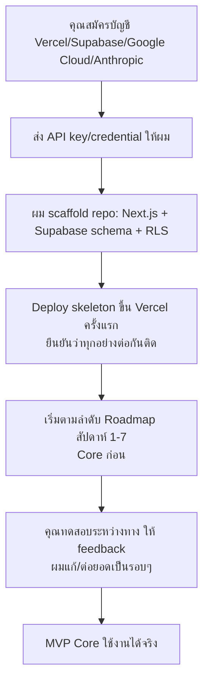

# Setup Checklist — ก่อนเริ่มเขียนโค้ด MVP Core
**เวอร์ชัน:** 1.0 — สิ่งที่ต้องเตรียมก่อนผมเริ่มเขียนโค้ดจริง แบ่งเป็น "ต้องมีก่อนเริ่ม" กับ "เริ่มได้ก่อน เติมทีหลังได้"

---

## 1. บัญชี/บริการภายนอกที่ต้องสมัคร (คุณเป็นคนสมัครเอง ผมทำแทนไม่ได้)

| # | บริการ | ใช้ทำอะไร | ต้องมีก่อนเริ่ม? |
|---|---|---|---|
| 1 | **Vercel** (vercel.com) | โฮสต์ Frontend + API | ✅ ต้องมีก่อน |
| 2 | **Supabase** (supabase.com) — สร้าง project ใหม่ | Database (Postgres), Auth, Storage | ✅ ต้องมีก่อน |
| 3 | **Google Cloud Console** — เปิดใช้ Custom Search API + Places API | Prospecting Agent ค้นหาบริษัท | ✅ ต้องมีก่อน (อย่างน้อย Custom Search) |
| 4 | **Anthropic API** (console.anthropic.com) — ขอ API key แยกสำหรับ production | รัน 5 AI Agents ตอนระบบใช้งานจริง (คนละอันกับที่คุณคุยกับผมตอนนี้) | ✅ ต้องมีก่อน |
| 5 | **Google Cloud OAuth Client** (สำหรับ Google Sheets API) | Import/Export ผ่าน Google Sheets | 🟡 เริ่มไม่มีก็ได้ — ใส่ทีหลังก่อนถึงสัปดาห์ที่ทำ Import จริง |
| 6 | **DBD (กรมพัฒนาธุรกิจการค้า)** — เช็คว่ามี API/บริการเปิดให้เรียกใช้หรือไม่ | ข้อมูลทุนจดทะเบียน/ประเภทธุรกิจไทย | 🟡 ถ้าไม่มี API เปิดให้ใช้ตอนนี้ ข้ามไปก่อน Prospecting Agent ยังทำงานได้จาก Google+Maps+Website |
| 7 | **Domain name** (ถ้าต้องการ custom domain เช่น app.rnp.co.th) | URL ของระบบ | 🟡 ไม่จำเป็น — ใช้ subdomain ฟรีของ Vercel ไปก่อนได้ (เช่น xtar.vercel.app) |

**วิธีส่งข้อมูลให้ผม:** เมื่อสมัครเสร็จ ส่ง API key/connection string มาในแชทได้เลย ผมจะเก็บไว้ในไฟล์ `.env.local` ที่ไม่ถูก commit ขึ้น git (ไม่ใช่ hardcode ในโค้ด) — ถ้ากังวลเรื่องความปลอดภัย แจ้งได้ ผมจะแนะนำวิธีใส่ผ่าน environment variable ของ Vercel/Supabase dashboard โดยตรงแทนการพิมพ์ในแชท

---

## 2. ข้อมูลธุรกิจที่ต้องเตรียม

| # | ข้อมูล | ใช้ทำอะไร | ต้องมีก่อนเริ่ม? |
|---|---|---|---|
| 1 | รายชื่อผู้ใช้เริ่มต้น (ชื่อ, อีเมล, Role: Admin/Sales Manager/Sales Rep/Executive) | สร้าง user แรกเข้าระบบ | ✅ ต้องมีอย่างน้อย 1 คน (Admin) |
| 2 | ไฟล์ Excel ข้อมูลลูกค้าเดิมของ RNP/PUKA | ทดสอบ Import จริง | 🟡 ไม่ต้องมีตอนเริ่ม แต่ควรเตรียมไว้ก่อนถึงสัปดาห์ Import |
| 3 | รายชื่อคู่แข่งเริ่มต้น (มีชุดที่ตกลงไว้แล้ว: DHL, FedEx, UPS, Maersk, DB Schenker, Kuehne+Nagel, Dimerco, Nippon Express, Yusen, SCGJWD, Kerry Logistics, Local Forwarder) | Seed ข้อมูลใน Competitor Master | ✅ มีอยู่แล้วจากเอกสาร ใช้ได้เลย |
| 4 | โควตาค้นหาฟรี/เดือน และ Budget Cap ที่ต้องการ (ค่าเริ่มต้นในเอกสาร: 100 บริษัท/เดือน) | ตั้งค่า Free Trial Quota (FR-1.7) | 🟡 ใช้ค่า default ไปก่อนได้ ปรับทีหลังได้ตลอด |
| 5 | โลโก้/ชื่อทางการของ RNP Express และ PUKA Logistic (ถ้าต้องการให้ขึ้นใน UI) | Branding เบื้องต้น | 🟡 ไม่จำเป็นสำหรับ MVP ใช้ชื่อ text ไปก่อนได้ |
| 6 | **Username/Password สำหรับ Perimeter Gate** (ด่านก่อนถึงหน้า Login — ดู [14-Security-Permission-Model.md §2](14-Security-Permission-Model.md)) — คิดชุดที่จะแจกให้พนักงาน RNP/PUKA ทุกคนใช้ร่วมกัน | ป้องกันคนนอกเห็นแม้แต่หน้า Login ของระบบ | ✅ ต้องมีก่อนเริ่ม (ตั้งเป็นค่า default ชั่วคราวได้ แล้วเปลี่ยนทีหลัง) |

---

## 3. การตัดสินใจเล็กๆ ที่ต้องยืนยันก่อนเริ่ม (เอกสารยังไม่ได้ระบุ)

| # | คำถาม | ค่า default ที่ผมจะใช้ถ้าไม่ระบุ |
|---|---|---|
| 1 | สกุลเงินหลักของระบบ (ราคา/มูลค่าดีล) | บาท (THB) — ใส่ multi-currency ต่อ Deal ได้ตาม schema เดิม |
| 2 | Timezone | Asia/Bangkok (ICT) |
| 3 | ชื่อ Admin คนแรก | ต้องระบุจริง (ไม่มี default) |
| 4 | Threshold "เสี่ยงหลุด" (ไม่มี Activity กี่วัน) | 14 วัน (ปรับได้ที่ Admin settings) |
| 5 | Threshold ขั้นต่ำต่อ segment สำหรับ Sales Learning Agent | 5 ดีลปิดแล้ว/segment (ตาม FR-18.3) |

---

## 4. ลำดับขั้นตอนเมื่อพร้อม

**สิ่งที่ผมทำได้ทันทีโดยไม่ต้องรอคุณ:** เขียน schema/migration, โครง component UI, business logic, prompt ของ AI agents — ทำเป็น scaffold ไว้ล่วงหน้าได้ แต่**รันจริง/deploy/ทดสอบ end-to-end ไม่ได้จนกว่าจะมี credential จากข้อ 1**

---

## 5. สรุปสิ่งที่ "ต้องมีก่อนเริ่มจริง" (ขั้นต่ำสุด)

ถ้าอยากเริ่มเร็วที่สุด สิ่งที่จำเป็นจริงๆ มีแค่:
1. บัญชี Supabase (สร้าง project เปล่าไว้)
2. บัญชี Vercel
3. Anthropic API key (production)
4. Google Cloud API key (Custom Search อย่างน้อย)
5. ชื่อ+อีเมลของ Admin คนแรก
6. Username/Password สำหรับ Perimeter Gate (ด่านก่อนหน้า Login)

ที่เหลือ (Google Sheets OAuth, DBD, ไฟล์ Excel เดิม, โลโก้) เริ่มไม่มีก็ได้ ผมจะ mock/ข้ามไปก่อนแล้วเติมทีหลังตามจังหวะ Roadmap
